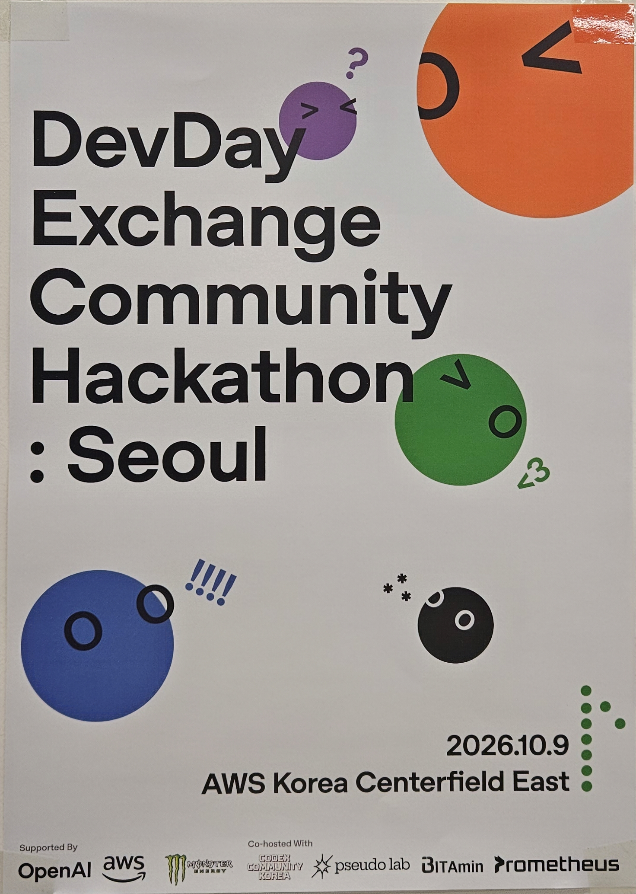
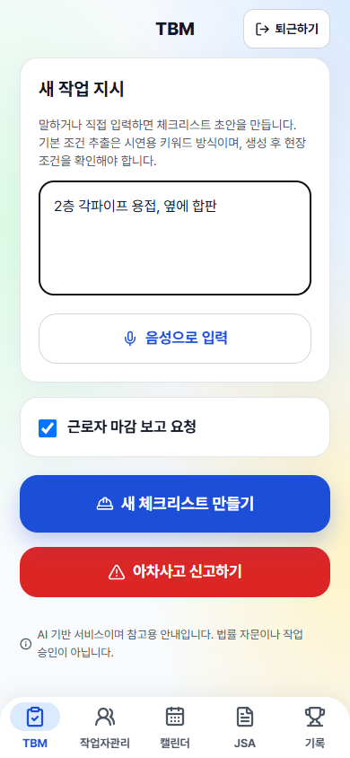
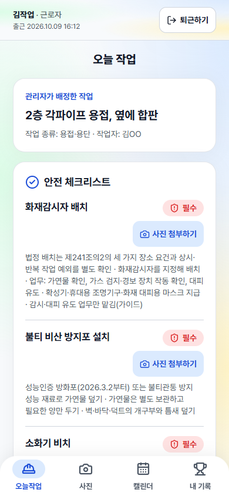
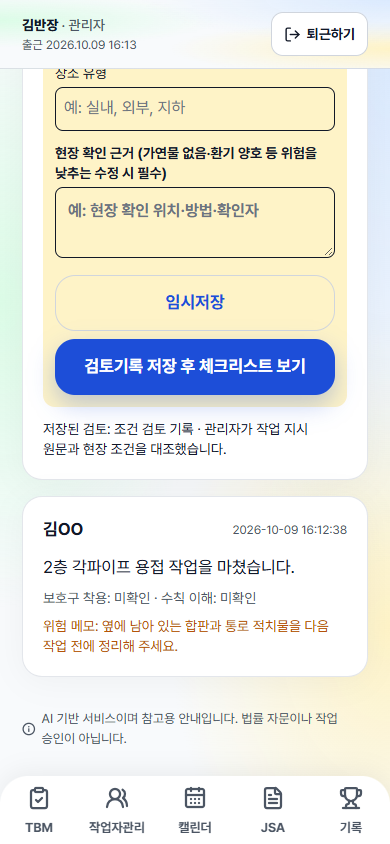

# 안전반장

건설 현장의 관리자와 근로자가 함께 쓰는 모바일 안전 기록 PoC입니다. 관리자가 작업 지시를 등록하면, 작업 조건을 바탕으로 안전 체크리스트와 위험성평가 초안을 만들고, 근로자는 체크리스트 사진 증빙·위험 신고·마감 보고를 제출합니다. 관리자는 제출 내용을 검토하고 필요한 후속 조치를 기록합니다.

> 안전반장은 작업 허가 시스템이나 법률 자문 서비스가 아닙니다. 체크리스트·위험성평가·AI 판정은 현장 확인을 돕는 참고 정보이며, 최종 판단과 조치는 관리자가 수행합니다.

## 행사 참여



안전반장은 **OpenAI DevDay Community Hackathon Seoul**에 참여하여 개발한 프로젝트입니다. 건설 현장의 작업 지시부터 안전 체크리스트, 사진 증빙, 관리자 검토까지 이어지는 모바일 안전 기록 PoC를 만들었습니다.

## 팀원과 역할

| 이름 | 학교·전공 | 커뮤니티 | 주요 담당 |
| --- | --- | --- | --- |
| 남재은 | 이화여자대학교 데이터사이언스학과 | 투빅스 | 데이터 계약, 실행 기록, LLM·프롬프트, 안전 워크플로우, 평가 |
| 김천지 | 상명대학교 컴퓨터과학전공 | 프로메테우스 | GitHub 코드·형상관리, 개발 환경, DB·API, 모바일 웹, 통합·문서 |
| 김준이 | 한국외국어대학교 전자물리학과 | 프로메테우스 | 안전 수칙 데이터, 점수·참여 연속 기록·순위, 관련 테스트·문서 |

### 남재은 — 데이터 계약·AI 워크플로우·평가

- **데이터 계약:** 작업 조건, 체크리스트, 사진 판정 등 모듈 간 입출력 모델과 검증 기준을 정의합니다.
- **실행 기록:** 처리 단계와 결과를 추적할 수 있는 실행 기록 구조를 담당합니다.
- **LLM·프롬프트:** mock·OpenAI 클라이언트 호출 계약, 구조화 출력과 오류 처리, 조건 추출·사진 판정·검증 프롬프트를 담당합니다.
- **안전 가드와 워크플로우:** 추출 조건의 허용 값과 원문 근거를 검사하고, 작업 입력 → 사진 판정·검증 → TBM 검토 흐름을 연결합니다. 불확실한 결과는 관리자 검토로 넘깁니다.
- **평가·테스트:** 조건 추출과 오판 방지 테스트, 고정 데이터 기반 오프라인 평가 도구와 결과 기록을 담당합니다.

### 김천지 — 서버·모바일 웹·형상관리

- **코드·형상관리:** GitHub 코드 관리자(`@CheonjiKim`)로서 저장소 설정, 브랜치·PR 규칙, CODEOWNERS와 통합 작업을 담당합니다. 팀장 역할과는 별도입니다.
- **개발 기반:** Python·uv 환경, 의존성, 공통 설정과 mock 파이프라인을 구성합니다.
- **DB·API:** SQLite 저장 구조와 초기 데이터, 작업·조건·체크리스트·사진 증빙·TBM·위험 신고·기록 조회 API 및 평가 결과 조회를 담당합니다.
- **모바일 웹:** React·Vite 기반 PWA, 공통 UI, 관리자·근로자 화면과 API 연결을 담당합니다.
- **통합·문서:** 팀원 모듈을 서버와 화면에 연결하고, 실행 방법·구현 범위·데모 관련 문서를 정리합니다.

### 김준이 — 수칙 데이터·점수·참여 기록

- **안전 수칙 데이터:** 용접·용단, 절단·원형톱, 도장·방수, 사다리·말비계의 PoC 수칙과 적용 조건·시나리오 매핑을 정리합니다. 법적 근거가 검수되지 않은 항목의 확인 필요 상태를 관리합니다.
- **점수 로직:** 확인된 사진 증빙, 위험 제보, TBM 참여의 적립 규칙과 중복 적립 방지를 담당합니다. 확인되지 않은 사진에는 점수를 부여하지 않습니다.
- **참여·무사고 기록:** 참여 연속 일수와 최근 14일 기록, 사고 보고·후속 조치 상태를 반영한 무사고 기록을 구분해 계산합니다.
- **집계:** 적립 당시 소속 팀 기준 순위, 개인 누적 순위와 스탬프를 담당합니다.
- **테스트·문서:** 수칙·점수 모듈 문서와 단위 테스트, 사고 후속 조치 및 참여 기록 API 검증을 담당합니다.

담당 범위는 저장소의 [남재은 작업 현황](docs/남재은_progress.md), [김천지 진행 보고](docs/김천지_progress.md), [김준이 작업 현황](docs/김준이_progress.md)을 바탕으로 정리했습니다. 각 진행 문서의 완료·대기 상태는 작성 시점 기준이며, 현재 구현 범위는 아래 내용을 참고하세요.

## 핵심 흐름

```text
관리자 작업 지시
  → 작업 조건 추출·확인
  → 체크리스트·위험성평가 초안 생성
  → 근로자에게 작업 배정
  → 근로자 체크·사진 증빙·위험 신고·마감 보고
  → 관리자 검토·재촬영 요청·직접 확인·후속 조치 기록
```

조건이 불명확하거나 사진 판정이 확실하지 않으면 자동으로 통과시키지 않고, 관리자 검토 대상으로 남기는 것이 기본 동작입니다.

## 역할별 화면

### 관리자

| 탭 | 할 수 있는 일 |
| --- | --- |
| TBM | 새 작업 지시를 입력하거나 음성으로 기록하고, 체크리스트 초안을 생성합니다. 현재 작업은 관리자 검토 모달에서 이어서 확인합니다. 근로자 마감 보고 요청 여부와 관계없이 체크리스트를 생성할 수 있으며, 아차사고 신고도 등록할 수 있습니다. |
| 작업자관리 | 작업이 배정된 근로자의 이름과 작업 내용을 보고, 안전 체크리스트에서 근로자의 사진 첨부·완료 상태를 확인합니다. |
| 캘린더 | 2026년 10월의 날짜별 작업을 최대 3개까지 표시하고, 더보기에서 그날의 전체 작업을 봅니다. |
| JSA | 작업 조건, 안전 수칙, 위험성평가 초안을 확인하고 수정 가능한 JSA 초안을 관리합니다. |
| 기록 | 점수·참여 기록을 확인합니다. |

관리자는 추가 경로에서 작업 조건 수정, 사진 증빙 검토, TBM 기록, 아차사고 후속 조치도 수행할 수 있습니다.

### 근로자

| 탭 | 할 수 있는 일 |
| --- | --- |
| 오늘작업 | 관리자가 배정한 작업과 안전 체크리스트를 확인합니다. 필수·권장 항목 모두 사진을 첨부할 수 있고, 첨부가 끝나면 항목 제목과 버튼에 완료 표시가 나타납니다. |
| 사진 | 위험 요소 사진과 설명을 제출합니다. 설명을 입력하기 전에는 제출 버튼이 비활성화되며, 제출 목록에서 조치중/조치 완료 상태를 확인합니다. |
| 캘린더 | 본인에게 배정된 작업만 날짜별로 확인합니다. |
| 내 기록 | 개인 점수와 참여 기록을 확인합니다. |

## 작업·증빙 상태

| 상태 | 의미 |
| --- | --- |
| `pending` | 작업 종류 등 확인이 필요한 조건이 있어 관리자 검토가 필요한 작업 |
| `ready` | 현재 조건으로 체크리스트 초안이 생성된 작업. 작업 승인 의미는 아님 |
| `attached` | 근로자가 해당 체크리스트 항목에 사진 증빙을 제출한 상태 |
| `resolved` | 관리자가 해당 항목을 검토·완료 처리한 상태 |
| `confirmed` | 사진 판정 및 필요한 검증이 확인된 상태 |
| `not_visible` / `uncertain` | 사진에서 항목이 보이지 않거나 판정이 불확실한 상태. 검토 대기열로 남음 |

`attached`와 `resolved`는 의도적으로 분리되어 있습니다. 근로자가 사진을 올렸다고 해서 관리자의 현장 확인·조치가 자동으로 끝나지 않습니다.

## 현재 구현 범위

- 네 가지 PoC 작업 유형(용접·용단, 절단·원형톱, 도장·방수, 사다리·말비계)의 조건 기반 체크리스트와 위험성평가 초안
- 작업 문장 조건 추출, 미확인 조건 표시·관리자 보정, 체크리스트 재생성
- TBM 입력·음성 전사, 필수 수칙 누락 확인, 작업 마감 보고와 위험 메모
- 체크리스트별 사진 증빙, 사진 판정·검증, 관리자 재촬영 요청·직접 확인·확인 불가 처리
- 근로자 위험 요소 신고와 후속 조치 상태, 점수·참여 연속 기록
- React 기반 모바일 웹(PWA)과 FastAPI API, SQLite 로컬 저장

기본 LLM/사진 판정 모드는 네트워크를 호출하지 않는 `mock`입니다. 실제 API는 사람이 환경변수를 설정했을 때에만 사용합니다.

## 실행 방법

필요 환경은 Python 3.12+, [uv](https://docs.astral.sh/uv/), Node.js 20.19+ 또는 22.12+, npm입니다.

### 1. 의존성 설치

```bash
uv sync
cd web
npm install
cd ..
```

### 2. 백엔드 실행

저장소 루트에서 실행합니다.

```bash
uv run uvicorn app.main:app --reload --port 8000 --env-file .env
```

기본 데이터베이스는 `data/banjang.db`, 업로드 파일은 `data/uploads/`를 사용합니다. 둘 다 Git에 포함하지 않습니다.

### 3. 웹 개발 서버 실행

별도 터미널에서 실행합니다.

```bash
cd web
npm run dev
```

기본 접속 주소는 `http://localhost:5173`입니다. 개발 서버의 `/api` 요청은 `http://localhost:8000`으로 전달됩니다.

### 데모 계정

로그인 화면에서 다음 계정을 사용할 수 있습니다.

| 역할 | 아이디 | 비밀번호 |
| --- | --- | --- |
| 관리자 | `admin` | `1234` |
| 근로자 | `worker` | `1234` |

이 로그인은 시연용 고정 계정과 브라우저 세션을 사용합니다. 운영용 인증·인가 기능이 아닙니다.

## 선택 환경변수

기본값은 `BANJANG_LLM=mock`입니다. 실제 외부 API 호출은 비용·개인정보·현장 검증을 고려해 사람이 명시적으로 설정할 때만 사용해야 합니다.

| 변수 | 용도 |
| --- | --- |
| `BANJANG_LLM=openai` | 작업 문장 조건 추출에 OpenAI 사용 |
| `BANJANG_VISION=openai` | 업로드 사진의 실제 비전 판정에 OpenAI 사용 |
| `OPENAI_API_KEY` | OpenAI 사용 시 필요한 API 키 |
| `BANJANG_DB` | SQLite 데이터베이스 경로 변경 |
| `BANJANG_UPLOADS` | 사진 업로드 경로 변경 |

실제 비전 경로가 연결되어 있어도 현장 사진 정확도나 안전 효과가 검증됐다는 뜻은 아닙니다.

## 검증

저장소 루트에서 백엔드 테스트를 실행합니다.

```bash
uv run pytest
```

웹 프로덕션 빌드는 다음과 같이 확인합니다.

```bash
cd web
npm run build
```

테스트는 기본 mock을 사용하며 실제 LLM·비전 API를 호출하지 않습니다.

## 화면 캡처

2026-10-09 기준 실제 앱 화면은 [캡처 목록](presentation/finals/captures/README.md)에서 확인할 수 있습니다.

| 관리자 작업 지시 | 근로자 오늘 작업 | 관리자 보고 검토 |
| --- | --- | --- |
|  |  |  |

캡처는 별도 mock DB와 업로드 경로에서 촬영했습니다. 사진 판정은 시연용 mock 또는 검증 불일치 시나리오이며, 실제 현장 판정 결과가 아닙니다.

## 프로젝트 구조

```text
.
├── app/                    # FastAPI, 작업·사진·TBM 워크플로우, SQLite
├── web/                    # React/Vite 모바일 웹
├── rules/                  # PoC 안전 수칙 JSON과 런타임 매핑
├── scoring/                # 점수·참여 연속 기록·순위 집계
├── eval/                   # 오프라인 평가 도구와 고정 평가 데이터
├── tests/                  # API·워크플로우·안전 가드·점수 테스트
├── presentation/finals/    # 최종 발표 자료와 앱 화면 캡처
├── SOURCES.md              # 데이터·외부 자료 출처
└── AGENTS.md               # 협업·Git·검증 규칙
```

더 자세한 구현 흐름과 현재 한계는 [전체 서비스 구현 및 확장 워크플로우](docs/서비스_전체_구현_및_확장_워크플로우.md), 수칙의 PoC 범위는 [rules/README.md](rules/README.md), 평가 방법은 [eval/README.md](eval/README.md)에서 확인할 수 있습니다.

## 한계와 운영 전 확인 사항

- 수칙 데이터는 PoC 범위이며, 법령 원문·현장 위험성평가를 대체하지 않습니다. 출처와 적용 조건은 현장 안전 담당자가 검토해야 합니다.
- mock 조건 추출과 TBM 누락 비교는 제한된 키워드·별칭 규칙을 사용합니다. 모든 자연어 문맥을 이해하지 않습니다.
- 불확실한 사진은 자동 통과·자동 점수 처리하지 않지만, 실제 사진 판정 정확도는 별도 평가가 필요합니다.
- 현재 인증은 데모용이며, 운영에는 실사용자 인증, 역할·현장 권한, 감사 로그, 업로드 보안, 보존·삭제 정책이 필요합니다.
- 사진·음성·위험 메모에는 개인정보 또는 민감 정보가 포함될 수 있으므로 최소 수집·접근 통제·보존 기간을 별도로 정해야 합니다.

## 협업

기여 전에는 [AGENTS.md](AGENTS.md)의 브랜치·PR·검증 규칙을 따릅니다. `main`에는 직접 커밋하거나 병합하지 않으며, 변경은 PR로 검토합니다.
