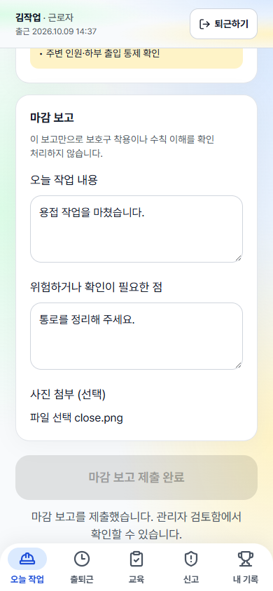
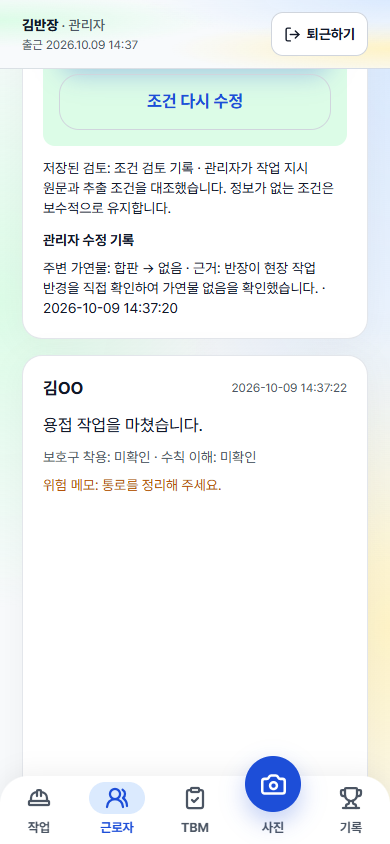

# 기록·제출 흐름 검증

발표자료가 아닌 개발 검증 기록입니다. 실제 AI API, 운영 DB, 실제 사진을 사용하지 않았습니다.

## 결과

- `uv run pytest -q`: 153 passed. 기존 Starlette/httpx 사용 중단 예정 경고 1건.
- `cd web` 후 `npm run build`: 통과.
- Edge headless 390×844, 실제 로컬 FastAPI와 빌드 결과 연결: 전체 흐름 통과, pageerror 0건.
- 작업 등록 → 가연물 없음 근거 기록 → 조건 검토 → TBM → 모의 사진 판정 실패 → 관리자 직접 확인 → 개인 점수 → 퇴근·작업자 로그인 → 마감 제출 → 관리자 미확인 표시.
- TBM: 의도한 503 오류 뒤 입력 유지. 재시도 시 연속 제출을 해도 성공 요청 1회, 저장 완료 후 동일 내용 재제출 비활성화.
- 마감: 연속 제출에도 보고 1건. 사진 첨부를 한 번 실패시키고 재시도하여 업로드 총 2회, 보고 추가 생성 없음.
- 반장 13점, 작업자 0점으로 개인 기록 분리. 별도 API 회귀 테스트에서 작업자 사진의 관리자 확인 점수 10점이 제출자에게 귀속됨을 확인.
- 보호구 착용·이해도 미응답은 API null, 관리자 화면 미확인. 명시적 false와 true도 각각 보존.

## 재현

Windows에 Edge, uv, Node가 있어야 합니다. 프로젝트 루트에서 실행합니다.

```powershell
uv run pytest -q
npm --prefix web run build
npm install --prefix tmp/browser-check playwright --no-audit --no-fund

$runId = [guid]::NewGuid().ToString('N')
$env:BANJANG_LLM = 'mock'
$env:BANJANG_VISION = 'mock'
$env:BANJANG_DB = Join-Path (Get-Location) "tmp/check-$runId.db"
$env:BANJANG_UPLOADS = Join-Path (Get-Location) "tmp/uploads-$runId"
$env:BANJANG_TRACE_DIR = Join-Path (Get-Location) "tmp/traces-$runId"
uv run uvicorn app.main:app --host 127.0.0.1 --port 8018
```

별도 터미널에서 `node tests/browser_flow.cjs`를 실행합니다. 다른 포트는 `BANJANG_TEST_URL`로 지정합니다. 매 실행마다 빈 DB가 필요합니다. 스크린샷은 `tmp/browser-check/`에 생성됩니다. 실행 후 검증 서버를 종료합니다.

## 화면





## 범위와 한계

- 개인 기록 조회 수정은 실제 인증·권한 관리의 구현이 아닙니다.
- 기존 NOT NULL 정수 필드에서 -1은 미응답, 0은 아니오, 1은 예입니다. API는 미응답을 null로 반환합니다. 기존 과거 답변은 소급 변경하지 않습니다.
- 사진의 제출자 열을 기존 DB에 추가합니다. 과거 사진에서 제출자 정보가 없으면 기존 작업 담당자 귀속을 유지합니다.
- 제출 잠금은 현재 화면의 연속 클릭 방지입니다. 새로고침·다른 탭·응답 유실까지 포함한 서버 멱등성은 지원하지 않습니다.
- 브라우저 검증은 데스크톱 Edge의 모바일 화면 크기입니다. 실제 휴대폰·마이크·외부 AI 성능을 검증한 결과가 아닙니다.
- #25 선행 병합 후 #26 병합이 필요하며 에이전트는 PR을 병합하지 않습니다.
