# 안전반장 전체 서비스 구현과 확장 워크플로우

> 발표 자료의 서비스 전체 그림과 향후 워크플로우 설계를 위한 코드 기준 문서입니다. 현재 소스·API·DB·프런트엔드·테스트를 확인해 정리했습니다. `실제 구현`과 `확장 제안`을 구분하며, 구현돼 있다는 말은 곧 현장 성능이 검증됐다는 뜻이 아닙니다.

- 확인 기준: 현재 문서 브랜치의 `main` 최신화 후 코드와 저장소 자료
- 목적: AI가 불확실하거나 실패했을 때 자동 통과를 막고, 근거 확인과 사람 조치, 재조회 가능한 기록으로 이어지는 흐름 설명
- 핵심 사용자: 작업자, 반장·관리자, 안전 업무 담당자
- 제품 경계: 안전 수칙을 찾고 작업 정보를 정리하며 사람의 확인을 돕는 PoC. 법률 해석·법적 안전성 보증·작업 허가/승인을 제공하지 않음

## 한 장으로 보는 전체 서비스

아래는 현재 구현을 실선으로, 아직 코드에 연결되지 않은 확장 방향을 점선으로 그린 단일 서비스 그림입니다. 화면 구성보다 데이터가 어디서 들어와 어떤 판단과 안전 분기를 거쳐 어떤 기록으로 남는지에 초점을 둡니다.

```mermaid
flowchart LR
  subgraph PEOPLE[사용자]
    W[작업자]
    M[반장·관리자]
    S[현장 안전 담당자]
  end

  subgraph WEB[React 모바일 웹 · Vite PWA]
    INPUT[작업 지시 입력·음성 녹음]
    CHECK[작업 조건·체크리스트·위험 초안]
    TBMUI[TBM 내용 입력·음성 전사]
    PHOTOUI[사진 업로드·시연 실패 선택]
    REVIEWUI[작업/사진 검토 대기열]
    CLOSEUI[작업 마감 보고·위험 메모]
    INCIDENTUI[아차사고 신고·후속 조치]
    SCORESUI[점수·기록·평가 화면]
  end

  subgraph API[FastAPI · /api]
    TASKAPI[작업 생성·조회·조건 수정·관리자 검토]
    TBMAPI[TBM 누락 확인·기록]
    EVIDAPI[사진 저장·판정·검증·검토 조치]
    CLOSEAPI[근로자 마감 폼·사진]
    INCIDENTAPI[사고/아차사고·후속 조치]
    SCOREAPI[점수·순위·스탬프·연속 기록]
    EVALAPI[평가 결과 최신 JSON 조회]
  end

  subgraph TASKFLOW[작업 준비 파이프라인 · app/workflows/task.py]
    EXTRACT[조건 추출\nwork · height · flammable\nventilation · nearby_people · place]
    NORMALIZE[허용 값·원문 근거·지시문 점검]
    PIN[관리자 보정 조건 우선 적용]
    UNKNOWN{필수 조건 미상?}
    HOLD[review_status=pending\n작업 준비 미완료·관리자 검토]
    QUESTIONS[확인 질문 목록]
    RULES[조건별 PoC 체크리스트 생성]
    RISK[위험 평가 참고 초안]
    READY[체크리스트 제공\n작업 승인 아님]
  end

  subgraph AI[모델·수칙 구성]
    MOCK[기본 BANJANG_LLM=mock\n키워드 조건 추출·결정적 시연]
    OAI[선택적 OpenAI 구조화 출력\n설정·네트워크·응답 검증]
    JSONRULES[rules/*.json\n근거/PoC 자료 보관]
    PYRULES[현재 런타임 규칙\napp/pipeline/rules.py 하드코딩]
    RISKCODE[위험 초안 규칙\napp/pipeline/risk.py]
  end

  subgraph FIELD[현장 실행·피드백]
    MEETING[TBM 실시]
    COMPARE[필수 항목명과 입력 문구 비교]
    MISSING[누락 필수 수칙 표시]
    EXEC[작업 진행·체크리스트 확인]
    IMAGE[사진 증빙]
    JUDGE[1차 사진 판정\nconfirmed / not_visible / uncertain]
    VERIFY{confirmed인 경우\n독립 검증 근거도 유효?}
    AUTO[확인 완료 기록·점수 규칙 적용]
    HUMANHOLD[불확실·실패·검증 불일치\n점수 미적립·사진 검토 큐]
    ACTION{관리자 조치}
    RETAKE[재촬영 요청\n사유 입력]
    DIRECT[사진·수칙 직접 확인\n사유 입력]
    NO[확인 불가 처리\n사유 입력]
    CLOSE[작업 마감 텍스트·위험 메모·사진]
    INCIDENT[아차사고 기록 및 후속 조치]
  end

  subgraph STORE[영속 기록]
    DB[(SQLite\nsites · workers · users\ntasks · checklist_items\nevidence_photos · evidence_reviews\nscore_events · tbm_logs\nworker_forms · incidents)]
    FILES[(업로드 파일\ndata/uploads)]
    TRACE[(실행 추적 JSONL\ndata/traces\n단계·지연·토큰·비용·오류)]
    EVALDATA[(평가 라벨·결과 파일\neval/data · eval/out)]
  end

  subgraph EXT[추가 구현 후보 · 현재 미연결/미완성]
    ENGINE[JSON 수칙을 버전·출처·조건과 함께 런타임 엔진에 연결]
    AUTH[실사용자 인증·역할/현장 권한·감사자 식별]
    VISION[실제 사진 모델 검증·촬영 품질/가림/범위 판단]
    OUTBOX[알림·담당자 배정·기한·에스컬레이션]
    METRICS[관리자 대시보드·실패율·오승인율·현장 피드백]
    PRIVACY[개인정보 최소수집·보존/삭제·접근 통제]
    MOBILE[오프라인·불안정 통신 재시도/중복 방지]
  end

  W --> INPUT --> TASKAPI --> EXTRACT
  EXTRACT --> MOCK
  EXTRACT -. 모델 설정 시 .-> OAI
  MOCK --> NORMALIZE
  OAI --> NORMALIZE
  NORMALIZE --> PIN --> UNKNOWN
  UNKNOWN -->|예| HOLD --> DB
  UNKNOWN -->|예| QUESTIONS --> REVIEWUI
  UNKNOWN -->|아니오| RULES --> READY --> CHECK
  RULES --> PYRULES
  PYRULES -. 아직 직접 런타임 입력으로 로드하지 않음 .-> JSONRULES
  RULES --> RISK --> RISKCODE --> CHECK
  M --> REVIEWUI
  REVIEWUI -->|조건 수정·체크리스트 재생성| TASKAPI
  TASKAPI --> DB
  TASKAPI -->|원문 대조·조건 보정| PIN
  CHECK --> TBMUI --> TBMAPI --> COMPARE --> MEETING
  COMPARE -->|필수 항목 누락| MISSING --> TBMUI
  TBMAPI --> DB
  CHECK --> EXEC --> PHOTOUI --> EVIDAPI --> FILES
  EVIDAPI --> JUDGE
  JUDGE -->|confirmed| VERIFY
  JUDGE -->|not_visible / uncertain / 오류| HUMANHOLD
  VERIFY -->|예| AUTO --> DB
  VERIFY -->|아니오·예외·근거 없음| HUMANHOLD --> DB
  HUMANHOLD --> REVIEWUI
  REVIEWUI -->|사진 조치 저장| EVIDAPI
  EVIDAPI --> ACTION
  ACTION -->|재촬영| RETAKE --> DB
  ACTION -->|직접 확인| DIRECT --> DB
  ACTION -->|미확인 유지| NO --> DB
  RETAKE --> W
  DIRECT -->|정책상 확인 처리| AUTO
  CLOSEUI --> CLOSEAPI --> CLOSE --> DB
  CLOSE -->|위험 메모 참고| TBMUI
  INCIDENTUI --> INCIDENTAPI --> INCIDENT --> DB
  INCIDENT --> S
  AUTO --> SCOREAPI --> DB
  TBMAPI --> SCOREAPI
  INCIDENTAPI --> SCOREAPI
  SCOREAPI --> SCORESUI
  S --> EVALDATA --> EVALAPI --> SCORESUI
  EXTRACT -. 모든 모델 실행 단계 .-> TRACE
  JUDGE -. 모든 모델 실행 단계 .-> TRACE
  COMPARE -. 워크플로우 실행 .-> TRACE

  JSONRULES -. 확장 .-> ENGINE
  ENGINE -. 안전 검증 후 .-> RULES
  M -. 계정/권한 적용 .-> AUTH
  JUDGE -. 실제 성능 검증 뒤 .-> VISION
  HUMANHOLD -. 알림/담당 배정 .-> OUTBOX
  EVALDATA -. 실제 운영 지표 .-> METRICS
  DB -. 정책·권한으로 통제 .-> PRIVACY
  API -. 복구 가능한 전송 .-> MOBILE

  classDef current fill:#e7f4eb,stroke:#36804a,color:#183b23;
  classDef caution fill:#fff3d7,stroke:#b77b00,color:#573b00;
  classDef extension fill:#edf0f5,stroke:#718096,color:#263344,stroke-dasharray: 5 5;
  class INPUT,CHECK,TBMUI,PHOTOUI,REVIEWUI,CLOSEUI,INCIDENTUI,TASKAPI,TBMAPI,EVIDAPI,CLOSEAPI,INCIDENTAPI,SCOREAPI,EXTRACT,NORMALIZE,PIN,QUESTIONS,RULES,RISK,READY,MOCK,OAI,PYRULES,RISKCODE,MEETING,COMPARE,MISSING,EXEC,IMAGE,JUDGE,VERIFY,AUTO,HUMANHOLD,ACTION,RETAKE,DIRECT,NO,CLOSE,INCIDENT,DB,FILES,TRACE,EVALDATA current;
  class HOLD,UNKNOWN caution;
  class SCORESUI,EVALAPI,ENGINE,AUTH,VISION,OUTBOX,METRICS,PRIVACY,MOBILE extension;
```

## 1. 현재 동작을 사용자 흐름으로 풀어 쓰면

### A. 작업 지시부터 체크리스트까지

1. 작업자는 모바일 웹의 `오늘 작업`에서 작업 문장을 입력하거나 브라우저 음성 녹음을 사용합니다. 작업 등록 요청은 `POST /api/tasks`입니다.
2. 기본 `mock` 클라이언트는 키워드 규칙으로 작업 종류, 높이, 가연물, 환기, 주변 인원, 장소를 추출하고 원문 근거 구절을 붙입니다. OpenAI 모드는 환경변수에 키와 작업/판정 모델이 모두 있을 때 선택할 수 있으며 구조화 JSON 응답을 사용합니다.
3. 정규화 단계는 허용 목록 밖 값, 원문 근거가 없는 안전 완화 값(예: `가연물 없음`), 안전을 낮추라는 식의 지시 문장을 거릅니다. 해당 값은 `알 수 없음`으로 남습니다.
4. 필수 조건이 여전히 미상이면 작업은 `pending`으로 저장되고 검토 대기 화면으로 이동합니다. 작업 원문과 추출값을 관리자가 대조하고 조건을 보정하면 체크리스트를 재생성합니다. 아직 미확인 조건이 남아 있으면 검토 완료 처리가 거부됩니다.
5. 작업 종류가 미상인 경우에는 모든 PoC 작업 체크리스트를 보수적으로 필수로 만들고 위험 초안도 전 작업 유형에서 만듭니다. 그 외 미상 조건은 작업 상태를 대기시키고 질문/필수 안내로 표시합니다.
6. 준비 완료 상태도 시스템의 법적·현장 작업 허가가 아닙니다. 체크리스트와 위험 초안은 사람의 확인을 돕는 참고 정보입니다.

### B. TBM(작업 전 안전 미팅)

- 작업자가 TBM 발언을 입력하거나 음성으로 전사합니다. `POST /api/tbm`은 현재 기록의 문장과 필수 체크리스트 항목명을 간단한 포함 관계로 비교해 언급되지 않은 필수 항목을 반환합니다.
- TBM 기록은 `tbm_logs`에 저장되고 작업당 최대 1회 3점이 적립됩니다. 현재는 문장 의미를 이해하는 AI 요약/의미 평가가 아니라 문자열 포함 비교입니다.
- `Recorder` 음성 전사는 별도 OpenAI API 호출이며, mock 안전 파이프라인과 다릅니다. 키가 없거나 네트워크가 안 되면 전사할 수 없습니다.

### C. 사진 증빙과 실패 처리

- 사진 업로드는 `POST /api/evidence`로 전송되고 파일은 업로드 폴더, 판정 결과는 `evidence_photos`에 저장됩니다.
- 실제 OpenAI 연결부는 이미지를 모델 요청에 담고 `confirmed`, `not_visible`, `uncertain` 중 하나의 구조화 응답을 기대합니다. `confirmed`인 경우에만 검증 단계를 한 번 더 거칩니다.
- 1차 판정 실패, 타임아웃/잘못된 응답, `uncertain`, 검증 예외, 검증 불일치는 자동 확인으로 끝나지 않고 검토 대상으로 남으며 점수는 0입니다. 검증은 `agrees=true`뿐 아니라 비어 있지 않은 근거 문자열도 요구합니다.
- 관리자는 검토 대기 목록에서 사진·관찰 내용·재촬영 힌트를 확인하고 `재촬영 요청`, `직접 확인`, `확인 불가` 조치를 사유와 함께 저장할 수 있습니다. 조치는 `evidence_reviews`에 남습니다. 관리자의 직접 확인은 한 번만 점수를 적립하며 항목별 중복 적립도 차단합니다.
- **현재 기본 mock은 사진 바이트를 실제로 보지 않습니다.** 사진을 올려도 시연을 위한 결정적 응답만 주므로 모델의 실제 시각 안전 판정 성능을 보여주지 않습니다. 실제 사진 모델 사용 가능 코드가 존재한다는 것과 안전하게 성능 검증됐다는 것은 다른 주장입니다.

### D. 작업 마감·사고/아차사고 기록

- 작업 마감 요청을 받은 작업자는 텍스트 보고, 위험 메모, 선택 사진을 제출합니다. 기록은 `worker_forms`와 업로드 파일에 저장됩니다. 위험 메모는 TBM 제안 목록에서 참고할 수 있습니다.
- 아차사고 신고는 `incidents`에 남고 후속 조치 완료 상태를 기록할 수 있습니다. 신고는 불이익 대신 5점 참여 점수를 주는 현재 규칙입니다.
- 점수 API는 개인/팀 순위, 이벤트, 스탬프, 연속 기록을 반환합니다. 다만 현재 `Ranking`, `Todo`, `Eval` 화면은 준비 중 placeholder입니다. API 구현과 사용자 화면 완성도를 별개로 봐야 합니다.

## 2. 구성요소별 구현 위치와 경계

| 영역 | 현재 코드 | 동작 및 경계 |
|---|---|---|
| 앱·정적 웹 제공 | `app/main.py`, `web/` | FastAPI API와 빌드된 웹 정적 파일 제공, Vite 개발 프록시. React Router는 Hash 경로를 사용합니다. |
| AI 호출 계약·mock | `app/llm/base.py`, `app/llm/mock.py` | 모델 호출 입력/출력 스키마와 네트워크 없는 시나리오 mock. 기본 설정은 mock입니다. |
| OpenAI 연동 | `app/llm/openai_client.py` | JSON schema 출력, 이미지 포함 판정, timeout/network/HTTP/JSON/스키마 오류를 `LLMError`로 변환. 실제 모델 정확도는 코드만으로 보증하지 않습니다. |
| 작업 파이프라인 | `app/workflows/task.py` | extract → normalize → pin → questions → rules → risk. 모델 예외 시 조건 전체를 UNKNOWN으로 만들어 안전 측으로 계속 흐릅니다. |
| 조건 추출/정규화 | `app/pipeline/extract.py`, `normalize.py` | 현재 mock 추출은 한국어 키워드/정규식. 정규화는 값 허용 목록과 원문 span, 특정 지시 표현 정규식을 사용합니다. 임의 문장 전체의 의미 검증은 아닙니다. |
| 체크리스트·위험 | `app/pipeline/rules.py`, `risk.py` | 4종 작업의 PoC 체크리스트와 위험 초안. 규칙 내용은 코드에 직접 정의돼 있습니다. JSON 수칙 파일을 동적으로 불러오는 엔진은 아직 아닙니다. |
| 사진 파이프라인 | `app/workflows/evidence.py`, `app/pipeline/judge.py` | 판정 후 confirmed에 한해 verify. mock 판정은 사진을 분석하지 않습니다. |
| API | `app/routers/*.py` | tasks, evidence, transcription, incidents, scores, TBM, worker forms, auth sample, eval latest를 제공합니다. 대표 경로는 아래 표 참고. |
| 저장소 | `app/db.py` | SQLite 테이블과 간단한 스키마 마이그레이션. 사용자/역할 테이블은 있지만 데모 인증 수준입니다. |
| 파일/추적 | `data/uploads`, `app/tracing.py` | 업로드 파일 로컬 보관. JSONL trace에 입력/출력, 실행 시간, 토큰/추정 비용, 오류를 기록합니다. 운영 보존/접근 정책은 별도 필요합니다. |
| 평가 | `eval/` | 고정 라벨 데이터로 작업 추출, 사진, TBM, 비용/지연과 변형 비교를 실행하는 오프라인 도구. 평가 화면은 아직 연결되지 않았습니다. |
| 테스트 | `tests/` | API·워크플로우·오판 방지·점수·평가·웹 셸 등을 자동 확인합니다. mock 시나리오와 일부 오류 경로를 테스트하지만 실제 모델 현장 정확도 테스트는 아닙니다. |

### 주요 API와 테이블

| 기능 | API | 저장 위치 |
|---|---|---|
| 작업 생성/조회/미확인 조건 보정/검토 | `POST /api/tasks`, `GET /api/tasks/{id}`, `GET /api/tasks/review-queue`, `PATCH /api/tasks/{id}/conditions`, `POST /api/tasks/{id}/review` | `tasks`, `checklist_items` |
| 체크리스트·위험·확인 질문 | `GET /api/tasks/{id}/checklist`, `/risk`, `/questions` | 작업 조건에서 재계산하거나 저장 체크리스트 조회 |
| 사진 판정·관리자 조치 | `POST /api/evidence`, `GET /api/evidence/review-queue`, `POST /api/evidence/{id}/reviews` | 이미지 파일, `evidence_photos`, `evidence_reviews`, 필요 시 `score_events` |
| TBM | `POST /api/tbm`, `GET /api/tbm-suggestions` | `tbm_logs`, `score_events` |
| 마감 보고 | `POST /api/worker-forms`, `/api/worker-forms/{id}/photo`, `/api/worker-forms/{id}/evidence` | `worker_forms`, 파일, 사진 증빙 테이블 |
| 할 일·점수 | `GET /api/todos`, `GET /api/scores` | 작업/증빙/점수 기록에서 생성 |
| 아차사고 | `POST/GET /api/incidents`, `POST /api/incidents/{id}/follow-up` | `incidents`, `score_events` |
| 평가 결과 | `GET /api/eval/latest` | `eval/out/*.json` 읽기 전용 |

## 3. 상태와 안전 규칙

### 작업 상태

- `ready`: 현재 여섯 조건 중 `work` 외 미확인 필수 조건이 남지 않은 상태입니다. 작업 승인 의미는 아닙니다.
- `pending`: 작업의 필수 조건 미상 또는 사진 판정 검토 사유가 저장된 상태입니다. 사진 검토는 별도 증빙 큐에도 표시됩니다.
- `reviewed`: 관리자가 조건 보정 검토 조치를 기록한 상태입니다.
- `cancelled`: 관리자가 작업을 취소한 상태입니다.

### 사진 상태

- `confirmed`: 판정이 확인되고, 검증을 켠 경로라면 검증 근거도 확인된 상태입니다. 또는 관리자가 `confirmed_by_manager` 조치로 직접 확인해 결과를 갱신한 상태입니다.
- `not_visible`: 수칙 항목이 사진에서 보이지 않는 판정입니다.
- `uncertain`: 판정 불가/실패/검증 거부 등을 포함하는 안전 보류 상태입니다.
- 비확정 상태는 `award_evidence`에서 점수 0입니다. 관리자 `confirmed_by_manager` 조치 때만 직접 확인 점수를 처리합니다.

### 코드와 테스트가 보장하는 것

- 작업 추출 모델을 사용할 수 없을 때 모든 조건이 UNKNOWN으로 유지되고 질문/보수 체크리스트가 생깁니다.
- 정상 사진 결과가 나오더라도 검증 불일치, 빈 근거, 예외가 나면 uncertain으로 내려갑니다.
- 사진 판정 예외는 검토할 Todo를 만들고 confirmed와 구분됩니다.
- 필수 안전 항목은 알 수 없음이면 보수적으로 필수 처리됩니다. 안전을 완화하는 값은 정규화에서 원문 근거 없이는 받아들이지 않습니다.
- 비확정 사진 점수 차단, TBM/증빙 중복 적립 방지 등은 점수 테스트에서 확인합니다.

## 4. 현재 한계와 특히 주의할 표현

1. **기본 시연은 mock입니다.** 기본 사진 판정은 실제 이미지 분류가 아니며, mock 성공 화면을 실제 AI 정확도 증거로 발표하면 안 됩니다.
2. **수칙 자료와 런타임 규칙은 분리돼 있습니다.** `rules/*.json`은 출처/PoC 시나리오를 보관하지만 실행 체크리스트는 Python `rules.py`가 생성합니다. 둘 간 동기화를 보장하는 자동 연결은 없습니다.
3. **규칙은 법률 검증 완료 자료가 아닙니다.** `rules/README.md`에는 PoC 범위와 검증이 필요한 항목이 명시돼 있습니다. 법률 원문·현장 위험성 평가의 대체라고 말하면 안 됩니다.
4. **조건 추출 mock은 키워드 기반입니다.** 자연어의 부정·수식·시간·장소 문맥을 모두 이해하지 않습니다. 정규화 가드도 허용 목록과 지정 정규식 범위입니다.
5. **TBM 누락 확인은 문자열 포함 비교입니다.** 유사 표현, 동의어, 맥락 추론은 현재 확인하지 않습니다.
6. **화면과 API 완성도는 다릅니다.** `Todo`, `Ranking`, `Eval`은 placeholder 화면입니다. API나 집계 코드가 있어도 실제 사용자 화면에서 모두 제공 중이라고 할 수 없습니다.
7. **로그와 데이터 운영 정책이 필요합니다.** trace는 작업 문장·조건 등 모델 입력/출력을 남길 수 있고, 사진/음성/위험 메모는 개인정보·민감정보일 수 있습니다. 최소 수집, 접근 통제, 보존 기간, 삭제, 제출물 제외를 정해야 합니다.
8. **데모 인증은 운영 인증이 아닙니다.** 샘플 로그인과 `reviewer` 문자열은 실제 반장 식별/권한 확인을 대체하지 않습니다. 관리자 조치의 감사 추적성은 실사용 전 강화해야 합니다.
9. **작업과 사진 검토 상태가 `tasks.review_status` 한 필드에 함께 들어갑니다.** 별도 사진 대기 큐는 `evidence_photos.result <> confirmed`로 조회합니다. 사진 검토 조치가 작업 조건 검토 이유를 덮거나 한 사진 처리로 작업 pending이 풀릴 수 있는 상태 전이도 있으므로, 동시 검토·분리 상태·완료 규칙을 다듬어야 합니다.
10. **웹 사진 입력은 현재 첫 체크리스트 항목에 파일을 연결합니다.** 각 사진 제출 UI와 지원 흐름은 시연 목적의 단순화가 있어 실제 현장 UX 확인이 필요합니다.

## 5. 현실적인 추가 구현 로드맵

아래는 이미 구현됐다고 주장하는 목록이 아니라 현재 구조에서 이어서 만들기 좋은 제안입니다.

### 우선순위 1: 검토 흐름의 완결성

- 작업 검토와 사진 검토를 별도 상태/큐로 분리하고 각각 담당자, 우선순위, 기한, 열람/조치 이력을 저장합니다.
- 관리자 조치 화면에서 원문, 추출 조건, 원문 span, 적용 수칙의 출처/버전, AI 응답/검증 실패 이유를 한 화면에서 비교합니다.
- 재촬영 요청에 작업자 알림·재업로드 연결·요청 기한·미응답 escalation을 연결합니다.
- “직접 확인”은 확인자 계정, 항목, 근거, 시각을 저장하고 중복/이후 재검토 규칙을 명확히 합니다.
- 재생성된 체크리스트 버전을 보관해 과거 사진/조치가 어떤 조건과 규칙을 기준으로 했는지 추적합니다.

### 우선순위 2: 안전 근거와 AI 품질 검증

- JSON 수칙을 단일 데이터 원천으로 삼고 스키마 검사, 규칙 버전, 현장 적용일, 출처 URL/문서 쪽수, 검수 담당자, 검수 상태를 구조화합니다.
- JSON→런타임 매핑을 테스트로 검증하고 화면의 각 항목에서 근거와 미검증 표시를 제공합니다.
- 실제 사진 모델을 붙일 경우 개인정보 제거/동의, 촬영 품질, 가림·거리·각도·장면 맥락을 분리해 검증합니다. 안전 필수 판정은 독립 검증 통과 전 자동 점수를 주지 않는 가드를 유지합니다.
- 평가 세트에 단순 정확도뿐 아니라 오승인률, 판정불가 비율, 항목별 recall, 검증 단계 효과, 작업 유형·조도·가림별 편향, 응답 실패율을 추가합니다.
- 평가 데이터 라벨의 출처·검수자·샘플 여부를 일관되게 기록하고, AI-Hub 후보처럼 검수 전 자료는 검증된 성능 수치에 포함하지 않습니다.

### 우선순위 3: 운영에 필요한 기본기

- 실사용 로그인, 비밀번호 해시, 역할/현장별 접근제어, 관리자 조치 감사로그를 추가합니다.
- 업로드 크기·형식 검증, 파일명/메타데이터 정리, 암호화·접근 제한, 자동 보존 만료/삭제 정책을 설정합니다.
- 모델 timeout, 네트워크 단절, 응답 불량에 대한 재시도 정책과 idempotency 키를 넣어 중복 작업·점수를 막습니다.
- 화면에 `Todo`, `Ranking`, `Eval` API를 실제 연결하고, 관리자 검토 큐와 모델 실패 현황을 보여 줍니다.
- 사용자 피드백을 작업 맥락과 연결하되 현장 확인값/관리자 수정값을 모델 정답처럼 무비판적으로 학습 데이터에 넣지 않습니다.

### 우선순위 4: 확장 가능한 현장 범위

- PoC 4종 작업 외 작업은 UNKNOWN/검토 대기로 안전하게 유지하고, 새 작업 유형은 현장 안전 담당자 검수 후 수칙·테스트·사진 평가 세트를 함께 추가합니다.
- 오프라인 현장에서는 입력을 로컬에 임시 보관하고 연결 복귀 후 전송하되, 중복 방지와 안전 미확인 표시를 설계합니다.
- 현장 시스템 연계(작업허가·교육·점검) 시 외부 시스템의 승인 상태를 안전반장 AI 판단과 혼동하지 않도록 출처·책임 주체를 표시합니다.

## 6. 발표에서 말할 수 있는 범위

### 코드/테스트로 확인할 수 있는 주장

- 작업 문장에서 여섯 조건을 추출하고 허용값·근거 검사를 거쳐 체크리스트와 위험 참고 초안을 만듭니다.
- 모델 실패/미확인 조건은 성공으로 가장하지 않고 관리자 검토 대기로 보냅니다.
- 사진 확인 결과는 검증 단계를 거치며, 실패·불일치·빈 근거는 자동 점수 처리하지 않습니다.
- 관리자의 조건 보정/사진 조치가 DB에 저장되고 다시 조회될 수 있습니다.
- mock 실패 시나리오와 관련 API/워크플로우/점수 테스트가 있습니다.

### 별도 실증 없이는 가정으로 표시할 내용

- 실제 현장 작업자가 이 흐름을 빠르고 쉽게 쓸 수 있다는 주장
- 실제 카메라 사진에서 위험을 높은 정확도로 찾는다는 주장
- 오승인율이나 사고 위험이 현장에서 감소했다는 주장
- 법률/수칙 데이터가 최신이고 모든 현장에 적용 가능하다는 주장
- 팀/관리자가 계속 도입하고 사용할 비용 대비 효과가 입증됐다는 주장

팀원/목표 사용자 피드백은 실제 수집 후 날짜·대상 범위·관찰 사항과 변경 사항을 기록합니다. 수집 전에는 “가정”이라고 표시합니다.

## 7. 근거 자료와 읽는 순서

- 구현 기준: `app/workflows/`, `app/pipeline/`, `app/routers/`, `app/db.py`, `app/llm/`, `app/tracing.py`, `scoring/`, `web/src/`
- 안전 실패/검증 근거: `tests/test_workflows.py`, `tests/test_misjudgment.py`, `tests/test_api.py`, `tests/test_scoring.py`
- 수칙 범위와 한계: `rules/README.md`, `rules/*.json`, `rules/poc_scenarios.json`
- 평가 데이터와 방법: `eval/README.md`, `eval/data/`, `eval/runner.py`, `eval/metrics.py`
- 역할별 과거 계획/진행 기록: `docs/*_progress.md`, `docs/jun-rules-data-review.md`
- `README.md` 및 역할별 진행 문서 일부는 현재 소스보다 오래된 단계의 설명입니다. “백엔드 없음/화면 준비 중” 같은 과거 설명은 현 상태의 근거로 사용하지 않았습니다. 현재 동작은 코드와 테스트를 기준으로 하고, 과거 문서는 작업 이력·원래 의도에 참고했습니다.

## 8. 최종 워크플로우를 그릴 때 권장하는 메시지

> 작업 지시에서 확인 가능한 조건과 안전 수칙을 연결하고, AI가 확신하지 못하면 판단을 보류한다. 관리자가 원문·근거·사진을 확인해 조치하면 그 결정과 이유를 기록해 다음 작업과 검증에 활용한다.

이 문장은 현재 구현된 안전한 보류와 관리자 조치의 방향을 설명합니다. “AI가 작업을 승인한다”, “AI가 법규를 해석한다”, “사진 안전 판정이 검증됐다”는 뜻으로 확장하지 않습니다.
